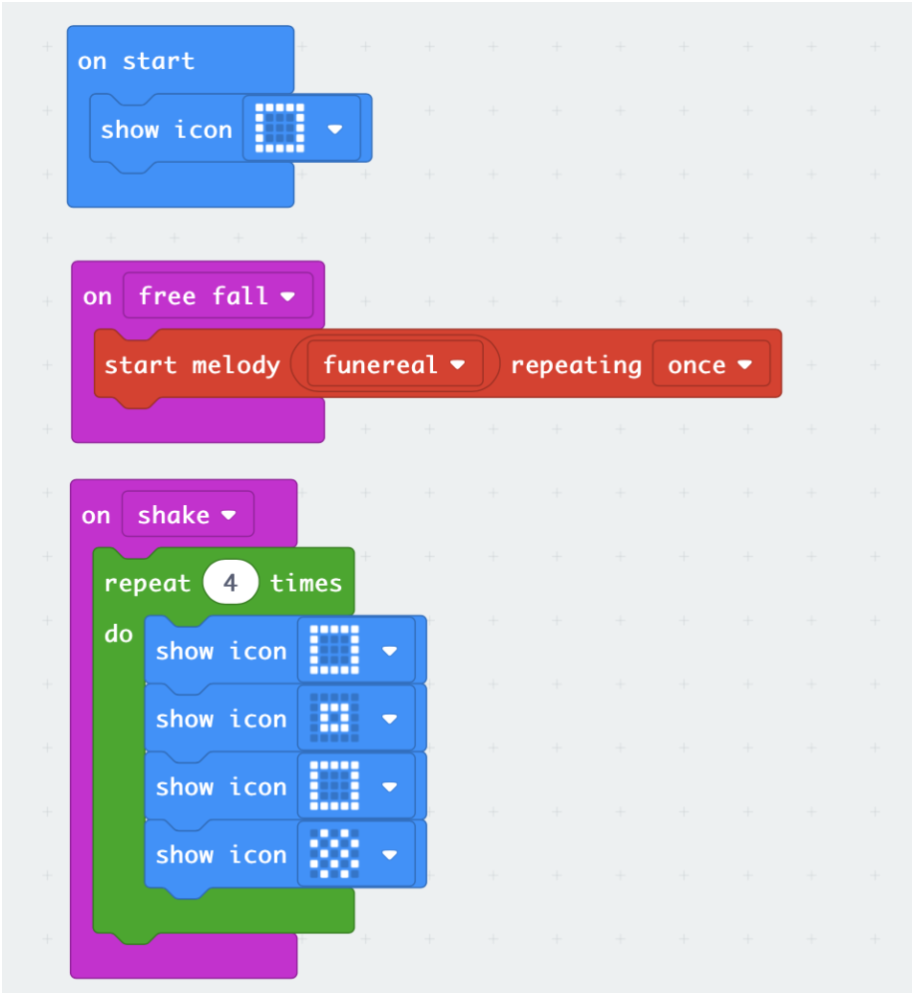
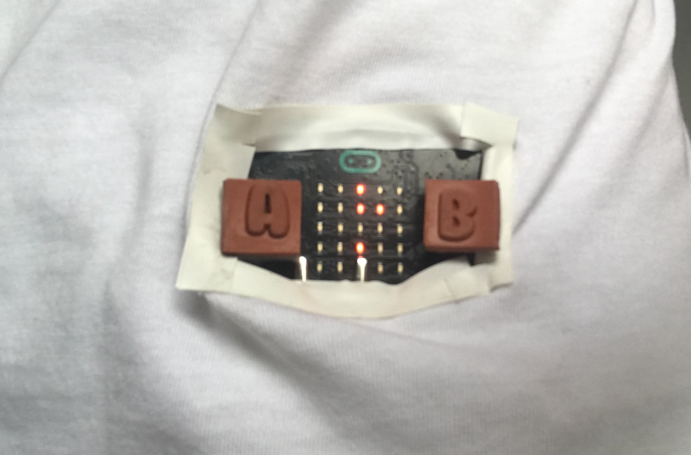
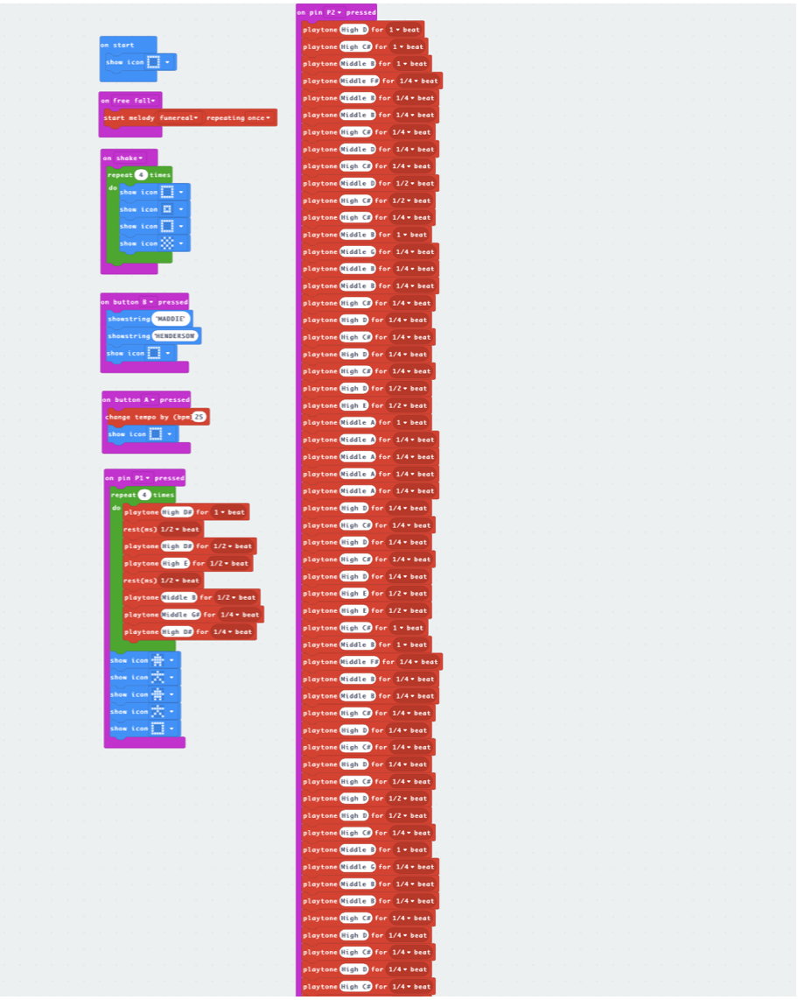
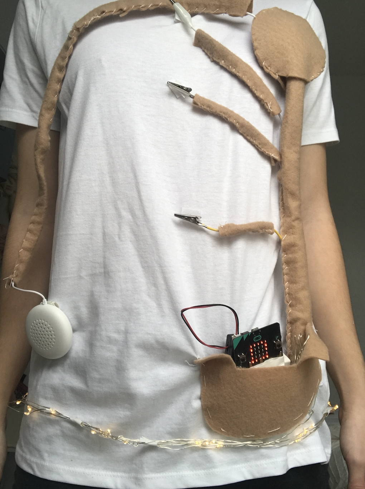
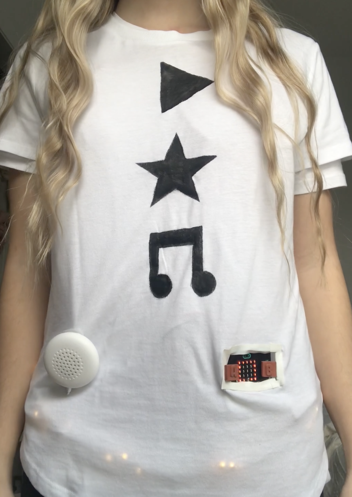
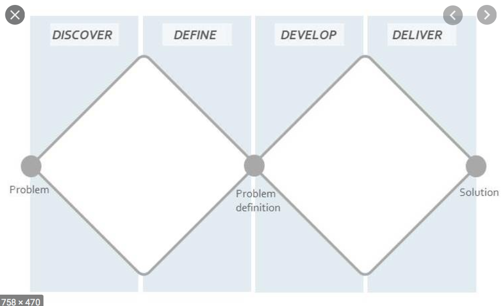

# 1701QCA Final project journal: *Madeleine Henderson*

<!--- As for other assessments, fill out the following journal sections with information relevant to your project. --->

<!--- Markdown reference: https://guides.github.com/features/mastering-markdown/ --->

## Related projects ##
<!--- Find about 6 related projects to the project you choose. A project might be related through  function, technology, materials, fabrication, concept, or code. Don't forget to place an image of the related project in the appropriate folder and insert the filename in the appropriate places below. Copy the markdown block of code below for each project you are showing. --->

### *IMIDI Jacket* ###

<!--- Modify code to insert image of related project below --->

https://www.youredm.com/2015/04/11/your-clothes-now-play-music-with-just-a-simple-touch/

This example is of a “soundable fashion” shirt. This design combines music and clothing creating a shirt that is basically a wearable drum set. This could be great when thinking about future possibilities, being able to apply a large range of pins all over the shirt. I do wonder how practically this item would be in regards to wearing it. Would it be comfortable and practical for day to day use?

### *Dressing Light* ###

<!--- Modify code to insert image of related project below --->

https://www.csmonitor.com/Technology/Tech-Culture/2009/0204/interactive-fashion-lets-costumers-wear-devices-on-their-sleeves

This example is of clothing that uses led screens and solar panels in built in clothing. The panels power the screens display images and communicating with others. This is a unique design that would be coming for me to consider when looking into how to display the screen on my design better. I like immersive and interactive this design would be.

### *LED T-shirt* ###

<!--- Modify code to insert image of related project below --->

https://www.youtube.com/watch?v=N_tcURO5Erg&feature=youtube_gdata_player

This next project is of a shirt that has a LED light system to portray different arrangements and images. This is another idea to consider with further developing to led light screen and buttons for my project. I Like how this project uses the whole shirt to make the patterns/ images clear and practical, although I don’t know how to make this commutable and practical without having to use a led board. 

### *Digital Clock T-Shirt With Stopwatch* ###

<!--- Modify code to insert image of related project below --->

https://www.youtube.com/watch?time_continue=29&v=WT77LSrKLvQ&feature=emb_logo

This project is a light up LED shirt that displays the time and also has a stop watch feature. This is again, a consideration in improving my design. I think my shirt could be improved after watching this video. I want to add in some light features and make my shirt engaging. I like how this shirt has a constant pin working to tell the time throughout the day.

### *LumiLor Car* ###

<!--- Modify code to insert image of related project below --->

https://www.youtube.com/watch?v=DVlrio1iT2o

This project uses a special type of spray paint with electric charge (Lumilor) to light up a car with sequences and unique designs. This could be something to consider when looking into added more light to my design. I like how this product can be applied to all sorts of items and can be controlled via a remote or app, making it not just a glow in the dark paint.

### *Bare Conductive Paint Wall* ###

<!--- Modify code to insert image of related project below --->

https://www.youtube.com/watch?v=pVvEQUbhar8

This project uses electric paint to create a interactive wall. I used the same electric paint in my  project and am considering further developing the design with this paint. I like how interactive and practical this product is and could work to further improve the buttons of my design or add to the design.

## Other research ##
Other research I have looked into is how to make my project more practical and refined, but also looking at options to improve my design. 

Flexible displays: 

https://www.youtube.com/watch?v=mo6nF-T58PA

This product is a flexible screen display that is extremely thin and practical for a design like mine. This could work as a perfect replacement for the microbic screen and buttons,  although this is a unrealistic product to use at this current time. But looking into future designs and design if there were no restraints, this would definitely be an idea option.

Another document I read about was the influence of touch. This was mostly based on customers being able to touch and interact with a product before purchase, but also had a lot of relevant information in regards to touch in general. This reinforces my choice to use pins and buttons to allow for touch mechanisms in the shirt. Touch allows for uses to feel like they have more ownership and over a product and its junction as well as influencing the use to really engage with it.

https://www.researchgate.net/publication/227630721_The_Effect_of_Mere_Touch_on_Perceived_Ownership 

## Conceptual development ##

### Design intent ###
To create a wearable party. 

### Design ideation ###

### Design concept 1 ###
1.	A fun party hat. 
This would include a disco ball attached to the top of the hat. The micro bit will create light up sequences and basically turn the hat into all the lighting equipment needed for a party, as well at making the person wear it look goofy and give everyone a bit of a laugh. 

notes:
- is it practical? 
- water proof? 
- would this work with a range of diffrent hat types?

### Design concept 2 ###
2.	Arm bands that light up with particular movements. 
Using LED lights and accelerometer sensors to make the dance floor and baisc movments more fun and interactive. 

notes:
- is this aesthetically pleasing, would it work with peoples fashion taste and outfits?
- dont thing this would really work with the amount of arm movments a person makes especially on a dance floor. 
- the diffrent light patterns wouldnt be clear and would constantly look like flashion lights no matter what the type of movement.

### Design concept 3 ###
3.	Party shoes that play different tunes depending on the type of moment. 
This would work by using accelerometers to retermin the type of movemnt and play a specific tune/ melody.

notes:
- again would this work with the amount of movemnt made especially on a dance floor.
- would this just get really annoying?
- how would this look aesthetically?
- what shoes would this work with? 

### Final design concept ###
4.	A shirt that plays different songs and lights up with different movements.

From all these concepts I decided that #4 is what I will create and further investigate into. I chose this concept as I felt that it suited and intent the best and was the most practical. The shirt idea means that it can be targeted at any gender, age etc, and it a practical and comfortable piece of clothing that people would usually wear to a party environment. This concept is also very doable considering having access to all the materials needed. I have now added to this design, including a string of LED lights, as well as moving the speaker and improving the buttons on the shirt. This has further improved the design and further suits the intent.

Does this project reflect the intent? 

 Yes, this project has achieved the idea of a “wearable party” allowing for the user to be able to engage with party music and interact with the shirt wherever they go. 
 
 ### New Design concept sketch ###
  

### Interaction flowchart ###

## Design process discussion ##
# Coding: 

Firstly, I created the coding for the Accelerometer features. Creating a “on shake” and “free fall” reaction. On shaking the micro bit, the led lights will display a pattern, rotating 4 time through 4 different images. Then of the free fall I added in a “sad” melody so that when a person wearing the shirt falls over or jumps around, the micro bit will express these actions in response and in adding more interaction. I also included an icon under “on start” I wanted to use this icon throughout the entire function of the shirt, to make it all tie together. 

Next I created the coding for the A and B button functions. For button A I created a tempo function, this allows for the user to be able to speed up the tunes playing. I made the function increase the tempo by 25%. For button B I added in the text function which I set to present my name. At the end of each command I included the square icon I had in the first section, this is to set the screen back to this defult image. 

Next I created the code for Pin 1. For this pin I wanted to create a melody of a popular and fun party song, so I replicated the tune of “shooting Stars” by Bag Raiders. This was a bit of a tedious process, but I only replicated a small portion of the key part of the song, I then put this on repeat 4 times to get the full effect of the song. I also included some star symbols that flash after the song plays, this ties into the visuals of the design, replicating the start symbol on the shirt. Lastly I again set the icon back to the default square. 

Next I created the code for Pin 2. Again, I replicated the melody of a popular party song, “Despacito” by Luis Fonsi. This was very, very tedious as I included a large part of the song, this was to give more variety in the time that a melody plays for, as well as playing enough of the song to make it recognisable to listeners. Again, I added in song note symbols at the bottom and the default square icon.

# Building the physical project

Firstly, I began by connecting all the cords to the conductors and the micro bit. Note that at this point in time I used aluminium foil as I had not yet received electric paint was still trialling and experimenting with materials.  

Next I began to secure all the connections and wires; this was to ensure that nothing would come loss and to keep everything together neatly. To do this I used white insulation tape. This keeps everything in its place, as well as keeping the connections waterproof. One area of concern I discovered in this section, was the durability of the tape over a period of time, tape isn’t the most effective and sustainable material, but improving this maybe something to look into when finalising my project. 

Next I attached all the components to the underlayer shirt. To do this I decided to us Velcro, as this will secure the components in place, whilst making them easily removed to be able to wash the shirt. To do this I stitched the pieces of Velcro to the shirt in the allocated places and used hot glue to attach it to the other components.   
 

Next I placed the top layer of the shirt over the bottom layer and mapped out where I would need to cut or paint. I then cut out a small rectangle in the top shirt, that allowed for the buttons and led lights to be visible. I also did the same on the back of the shirt for the speaker. When mapping out and matching both layers on the shirt, I lightly sketched out an outline of where the paint is to be applied. 

Next I painted on the symbols with electric paint to both sides of the top layer shirt, to ensure the paint seeps through to allow the sensors to work. After it dried I then hooked up the shirts.  
 

I also painted the inside of the shirt to make sure the paint would go through both the inside and outside of the shirt to make the connection. 

Then, I swapped out the aluminium conductors and valcroed the crocodile clips to line up with the paint.

From here I move into the refining stage of the task, looking to improve some issues and finalise the project. 

I began by changing the position of the speaker, moving it down to the bottom left side of the shirt. I found this was more ideal, as the sound wouldn’t be too loud and it would balance out the weight of the shirt a lot better. 

Next I added in a led strip around the waist band of the shirt, to making it more “party like”

Next, I added felt around all the cords and internal elements of the shirt. This helps to make the shirt more defined and neat. Also making the shirt more durable and practical. I used neutral coloured felt to appear invisible to the wearer. 

Lastly I added new larger buttons to improve visibility and practicality. I did want to add in a larger screen element, but this was not realistic especially in these times, in regards to what materials I could get access to. 

## Final code ##

 
## Design process discussion ##

Throughout the process of assignment 1&2, I followed and applied the double Dimond design to ensure I was working through the project effectively to get the best outcome possible. The double Dimond system first works by discovering a “problem”, this section is where I expand and look into all possibilities. This is exampled throughout my assignments, as well as discovering the issues that needed to be improved in this assignment. The next section is the “define” this section is where I narrowed down this issues, figure out exactly what the problem is which leads me to having a “clear problem” to then work from. This is seen though this assignment with the issues of position for the speaker, not having lights, the impractical buttons, and the messy cords. Next the Dimond expands again, as I then “develop” my design and work on finding solutions for those issues. Then lastly as the Dimond closes I refine the issues and “deliver” and complete the process on improving my design, which delivers me to having a clear solution.  

## Reflection ##

Reflecting on my assignment I feel that I have done well and learnt a lot throughout the entirety of this course. Throughout building this project I have spent a lot of time trialling and discovering solutions to problems and improving my design throughout. In this last section I felt that I was able to adequate improve my design, I really followed the double Dimond system and built upon examples and information I had discovered through the entirety of this project. I specifically gained influence and knowledge through the Illuminated Apparel and project 5 examples in assignment 2, these examples really influenced my idea to have the shirt active by pin press instead only movements. The Lumilor car example also inspired me to ass in LED lights as well as the Dressing Light project, really influencing my ideas for replacing the microbic screen. My project now feels more complete and novel with the interior design now a lot more refined and built to last, the added lighting now really makes the shirt match my intent better and really completes the shirt, as well as applying the recommendations from others to move the speaker and improve the visibility of the micro bit features. Building on from that last point, if I were to do an extension of this project (if there were no technology restraints) I would add in small LED screens or flexible screens, as seen in my research, instead of relying on the microbic LED board. I would  also want to expand the designs and colour to make the project more unique and versatile. Over all I felt like I learnt a lot and was happy with my efforts to create something that I never thought I would.  
