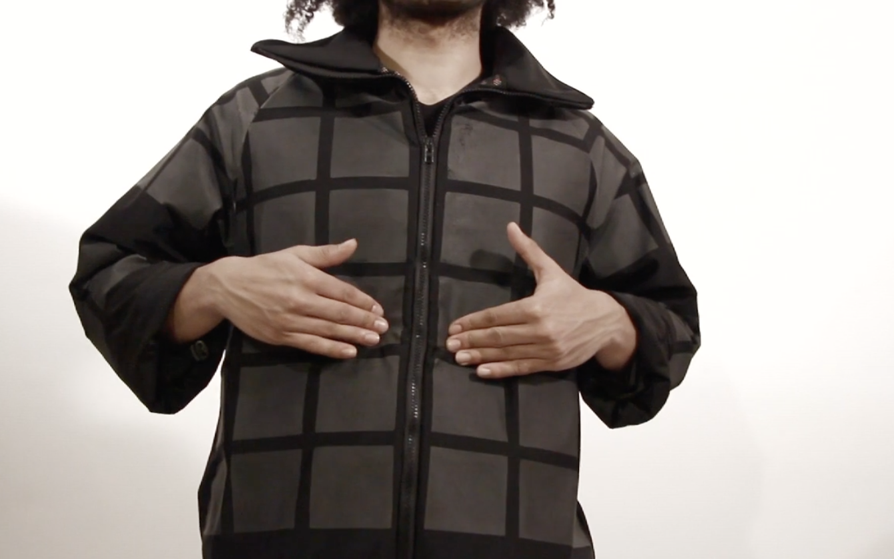
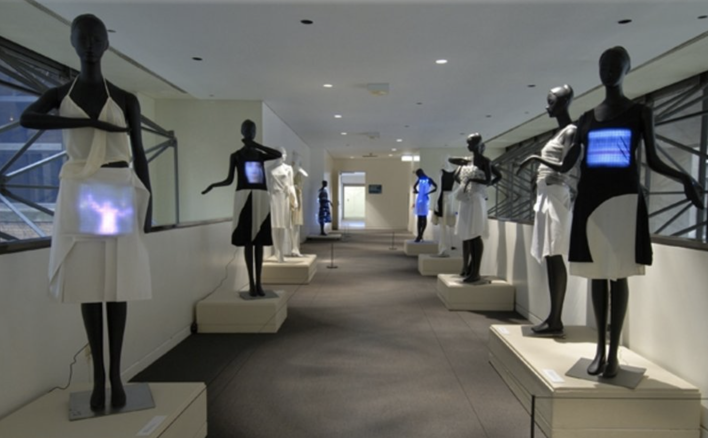
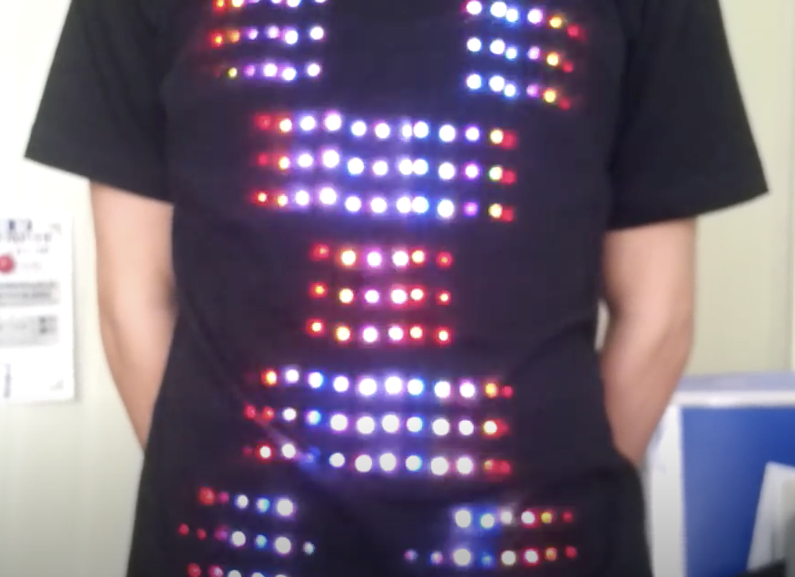
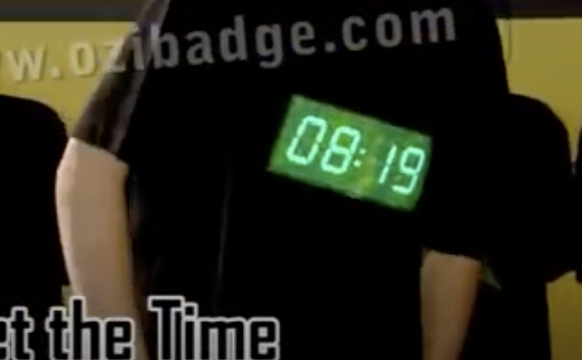
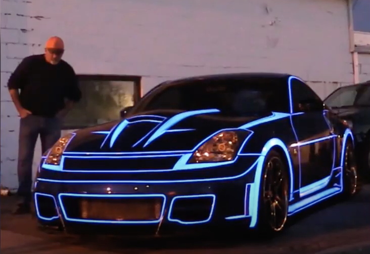
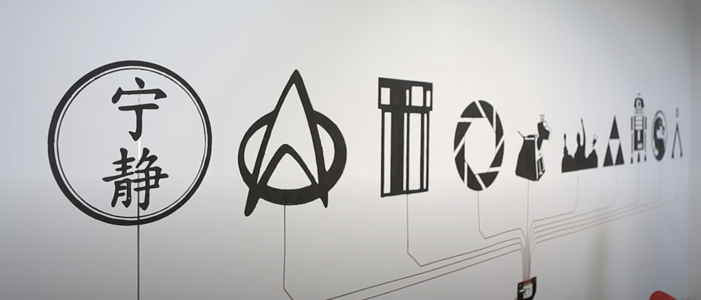

# 1701QCA Final project journal: *Madeleine Henderson*

<!--- As for other assessments, fill out the following journal sections with information relevant to your project. --->

<!--- Markdown reference: https://guides.github.com/features/mastering-markdown/ --->

## Related projects ##
<!--- Find about 6 related projects to the project you choose. A project might be related through  function, technology, materials, fabrication, concept, or code. Don't forget to place an image of the related project in the appropriate folder and insert the filename in the appropriate places below. Copy the markdown block of code below for each project you are showing. --->

### *IMIDI Jacket* ###

<!--- Modify code to insert image of related project below --->

https://www.youredm.com/2015/04/11/your-clothes-now-play-music-with-just-a-simple-touch/

This example is of a “soundable fashion” shirt. This design combines music and clothing creating a shirt that is basically a wearable drum set. This could be great when thinking about future possibilities, being able to apply a large range of pins all over the shirt. I do wonder how practically this item would be in regards to wearing it. Would it be comfortable and practical for day to day use?

### *Dressing Light* ###

<!--- Modify code to insert image of related project below --->

https://www.csmonitor.com/Technology/Tech-Culture/2009/0204/interactive-fashion-lets-costumers-wear-devices-on-their-sleeves

This example is of clothing that uses led screens and solar panels in built in clothing. The panels power the screens display images and communicating with others. This is a unique design that would be coming for me to consider when looking into how to display the screen on my design better. I like immersive and interactive this design would be.

### *LED T-shirt* ###

<!--- Modify code to insert image of related project below --->

https://www.youtube.com/watch?v=N_tcURO5Erg&feature=youtube_gdata_player

This next project is of a shirt that has a LED light system to portray different arrangements and images. This is another idea to consider with further developing to led light screen and buttons for my project. I Like how this project uses the whole shirt to make the patterns/ images clear and practical, although I don’t know how to make this commutable and practical without having to use a led board. 

### *Digital Clock T-Shirt With Stopwatch* ###

<!--- Modify code to insert image of related project below --->

https://www.youtube.com/watch?time_continue=29&v=WT77LSrKLvQ&feature=emb_logo

This project is a light up LED shirt that displays the time and also has a stop watch feature. This is again, a consideration in improving my design. I think my shirt could be improved after watching this video. I want to add in some light features and make my shirt engaging. I like how this shirt has a constant pin working to tell the time throughout the day.

### *LumiLor Car* ###

<!--- Modify code to insert image of related project below --->

https://www.youtube.com/watch?v=DVlrio1iT2o

This project uses a special type of spray paint with electric charge (Lumilor) to light up a car with sequences and unique designs. This could be something to consider when looking into added more light to my design. I like how this product can be applied to all sorts of items and can be controlled via a remote or app, making it not just a glow in the dark paint.

### *Bare Conductive Paint Wall* ###

<!--- Modify code to insert image of related project below --->

https://www.youtube.com/watch?v=pVvEQUbhar8

This project uses electric paint to create a interactive wall. I used the same electric paint in my  project and am considering further developing the design with this paint. I like how interactive and practical this product is and could work to further improve the buttons of my design or add to the design.

## Other research ##
Other research I have looked into is how to make my project more practical and refined, but also looking at options to improve my design. 

Flexible displays: 

https://www.youtube.com/watch?v=mo6nF-T58PA

This product is a flexible screen display that is extremely thin and practical for a design like mine. This could work as a perfect replacement for the microbic screen and buttons,  although this is a unrealistic product to use at this current time. But looking into future designs and design if there were no restraints, this would definitely be an idea option.

Another document I read about was the influence of touch. This was mostly based on customers being able to touch and interact with a product before purchase, but also had a lot of relevant information in regards to touch in general. This reinforces my choice to use pins and buttons to allow for touch mechanisms in the shirt. Touch allows for uses to feel like they have more ownership and over a product and its junction as well as influencing the use to really engage with it.

https://www.researchgate.net/publication/227630721_The_Effect_of_Mere_Touch_on_Perceived_Ownership 

## Conceptual development ##

### Design intent ###
<!--- Include your design intent here. It should be about a 10 word phrase/sentence. --->

### Design ideation ###
<!--- Document your ideation process. This will include the design concepts presented for assessment 2. You can copy and paste that information here. --->

### Final design concept ###
<!--- This should be a description of your concept including its context, motivation, or other relevant information you used to decide on this concept. --->

### Interaction flowchart ###
<!--- Include an interaction flowchart of the interaction process in your project. Make sure you think about all the stages of interaction step-by-step. Also make sure that you consider actions a user might take that aren't what you intend in an ideal use case. Insert an image of it below. It might just be a photo of a hand-drawn sketch, not a carefully drawn digital diagram. It just needs to be legible. --->

## Process documentation ##
<!--- In this section, include text and images (and potentially links to video) that represent the development of your project including sources you've found (URLs and written references), choices you've made, sketches you've done, iterations completed, materials you've investigated, and code samples. Use the markdown reference for help in formatting the material.

This should have quite a lot of information! It will likely include most of the process documentation from assessment 2 which can be copied and pasted here.

Use subheadings to structure this information. See https://guides.github.com/features/mastering-markdown/ for details of how to insert subheadings.

There will likely by a dozen or so images of the project under construction. The images should help explain why you've made the choices you've made as well as what you have done. --->

## Final code ##

<!--- Include here screenshots of the final code you used in the project if it is done with block coding. If you have used javascript, micropython, C, or other code, include it as text formatted as code using a series of three backticks ` before and after the code block. See https://guides.github.com/features/mastering-markdown/ for more information about that formatting. --->

## Design process discussion ##
<!--- Discuss your process used in this project, particularly with reference to aspects of the Double Diamond design methodology or other relevant design process. --->

## Reflection ##

<!--- Describe the parts of your project you felt were most successful and the parts that could have done with improvement, whether in terms of outcome, process, or understanding.

What techniques, approaches, skills, or information did you find useful from other sources (such as the related projects you identified earlier)?

What parts of your project do you feel are novel. This is IMPORTANT to help justify a key component of the assessment rubric.

What might be an interesting extension of this project? In what other contexts might this project be used? --->
